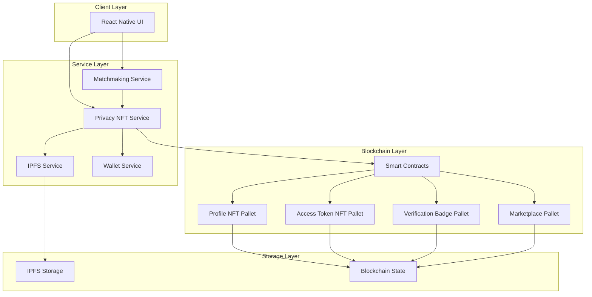

# Design Document: Privacy Protection NFT System

## Overview

The Privacy Protection NFT System provides granular access control for user profiles in a blockchain-based matchmaking application. The system tokenizes user profiles as NFTs with embedded access control rules, enabling users to control information visibility, monetize profile access, verify credentials, and maintain encrypted privacy vaults with complete audit trails.

### Core Design Principles

1. **Privacy by Default**: Sensitive information is encrypted and requires explicit permission to access
2. **User Sovereignty**: Profile owners maintain complete control over who accesses their information
3. **Transparency**: All access events are recorded in an immutable audit trail
4. **Monetization**: Users can earn revenue by selling access to their profile information
5. **Trust Building**: Verification badges provide cryptographic proof of identity and credentials

### System Boundaries

**In Scope:**
- Profile NFT minting and management
- Access token NFT creation, validation, and revocation
- Privacy marketplace for buying/selling access
- Verification badge NFT issuance
- Encrypted storage on IPFS
- Access audit trail recording
- Integration with existing privacy modes

**Out of Scope:**
- Verification document processing (assumed external service)
- Payment processing infrastructure (uses existing wallet system)
- IPFS node management (uses existing IPFS_Service)
- Blockchain consensus mechanisms (uses existing Substrate infrastructure)

## Architecture

### High-Level Architecture




### Component Interaction Flow

**Profile Creation Flow:**
1. User creates profile via UI
2. Matchmaking Service validates profile data
3. Privacy NFT Service encrypts sensitive data
4. IPFS Service stores encrypted data, returns content hash
5. Profile NFT Pallet mints Profile_NFT with metadata
6. Profile_NFT assigned to user's wallet

**Access Request Flow:**
1. Viewer attempts to access Detailed/Contact tier
2. Privacy NFT Service checks for valid Access_Token_NFT
3. If missing, UI prompts to purchase or request access
4. On purchase, Marketplace Pallet processes payment
5. Access Token NFT Pallet mints token to viewer's wallet
6. Audit event recorded in blockchain state

**Information Retrieval Flow:**
1. Viewer requests profile information
2. Privacy NFT Service validates Access_Token_NFT
3. Service retrieves encrypted data from IPFS
4. Service decrypts data using appropriate key
5. Decrypted data returned to viewer
6. Access event recorded in Audit_Trail

## Components and Interfaces

### Privacy NFT Service


**Responsibility:** Orchestrates NFT operations, access control validation, and encryption/decryption.

**Interface:**
```typescript
interface PrivacyNFTService {
  // Profile NFT Management
  mintProfileNFT(userId: string, profileData: ProfileData): Promise<ProfileNFT>;
  updateProfileNFT(nftId: string, updates: Partial<ProfileData>): Promise<void>;
  getProfileNFT(nftId: string): Promise<ProfileNFT>;
  
  // Access Token Management
  mintAccessToken(
    profileNftId: string,
    accessLevel: AccessLevel,
    duration: Duration,
    recipientAddress?: string
  ): Promise<AccessTokenNFT>;
  validateAccessToken(viewerAddress: string, profileNftId: string, tier: InformationTier): Promise<boolean>;
  revokeAccessToken(tokenId: string): Promise<void>;
  batchRevokeAccessTokens(tokenIds: string[]): Promise<void>;
  listAccessTokens(profileNftId: string, filters?: TokenFilters): Promise<AccessTokenNFT[]>;
  
  // Information Access
  getProfileInformation(
    profileNftId: string,
    viewerAddress: string,
    tier: InformationTier
  ): Promise<ProfileInformation>;
  
  // Verification Badges
  mintVerificationBadge(
    userId: string,
    badgeType: BadgeType,
    verificationData: VerificationData
  ): Promise<VerificationBadgeNFT>;
  getVerificationBadges(userId: string): Promise<VerificationBadgeNFT[]>;
  
  // Audit Trail
  getAuditTrail(profileNftId: string, filters?: AuditFilters): Promise<AuditEvent[]>;
  getAccessStatistics(profileNftId: string): Promise<AccessStatistics>;
  
  // Revenue Management
  getRevenueAnalytics(userId: string): Promise<RevenueAnalytics>;
  withdrawEarnings(userId: string, amount: number): Promise<Transaction>;
}
```

### Profile NFT Pallet (Substrate)

**Responsibility:** Manages Profile_NFT lifecycle on the blockchain.

**Storage:**
```rust
// Profile NFT storage
ProfileNFTs: map hasher(blake2_128_concat) NFTId => ProfileNFTData;
ProfileOwners: map hasher(blake2_128_concat) AccountId => Vec<NFTId>;
ProfileMetadata: map hasher(blake2_128_concat) NFTId => ProfileMetadata;
RevokedTokens: map hasher(blake2_128_concat) NFTId => Vec<TokenId>;
```

**Extrinsics:**
```rust
fn mint_profile_nft(origin, metadata: ProfileMetadata) -> DispatchResult;
fn update_profile_metadata(origin, nft_id: NFTId, metadata: ProfileMetadata) -> DispatchResult;
fn get_profile_nft(nft_id: NFTId) -> Option<ProfileNFTData>;
```

### Access Token NFT Pallet (Substrate)

**Responsibility:** Manages Access_Token_NFT and Contact_Access_NFT lifecycle.

**Storage:**
```rust
// Access Token storage
AccessTokens: map hasher(blake2_128_concat) TokenId => AccessTokenData;
TokensByProfile: map hasher(blake2_128_concat) NFTId => Vec<TokenId>;
TokensByOwner: map hasher(blake2_128_concat) AccountId => Vec<TokenId>;
```

**Extrinsics:**
```rust
fn mint_access_token(
    origin,
    profile_nft_id: NFTId,
    access_level: AccessLevel,
    expiration: BlockNumber,
    recipient: Option<AccountId>
) -> DispatchResult;

fn validate_access_token(
    viewer: AccountId,
    profile_nft_id: NFTId,
    tier: InformationTier
) -> bool;

fn revoke_access_token(origin, token_id: TokenId) -> DispatchResult;
fn batch_revoke_tokens(origin, token_ids: Vec<TokenId>) -> DispatchResult;
```

### Verification Badge Pallet (Substrate)

**Responsibility:** Manages Verification_Badge_NFT issuance and validation.

**Storage:**
```rust
// Verification Badge storage
VerificationBadges: map hasher(blake2_128_concat) BadgeId => BadgeData;
BadgesByUser: map hasher(blake2_128_concat) AccountId => Vec<BadgeId>;
BadgesByType: map hasher(blake2_128_concat) BadgeType => Vec<BadgeId>;
```

**Extrinsics:**
```rust
fn mint_verification_badge(
    origin,
    user: AccountId,
    badge_type: BadgeType,
    verification_hash: Hash
) -> DispatchResult;

fn get_user_badges(user: AccountId) -> Vec<BadgeData>;
fn verify_badge(badge_id: BadgeId) -> Option<BadgeData>;
```

### Marketplace Pallet (Substrate)

**Responsibility:** Handles buying/selling of Access_Token_NFTs.

**Storage:**
```rust
// Marketplace storage
Listings: map hasher(blake2_128_concat) ListingId => ListingData;
ListingsByProfile: map hasher(blake2_128_concat) NFTId => Vec<ListingId>;
RevenueBalances: map hasher(blake2_128_concat) AccountId => Balance;
PlatformFeePercentage: u8;
```

**Extrinsics:**
```rust
fn create_listing(
    origin,
    profile_nft_id: NFTId,
    access_level: AccessLevel,
    duration: Duration,
    price: Balance
) -> DispatchResult;

fn purchase_access(origin, listing_id: ListingId) -> DispatchResult;
fn cancel_listing(origin, listing_id: ListingId) -> DispatchResult;
fn withdraw_earnings(origin, amount: Balance) -> DispatchResult;
```

### Encryption Service

**Responsibility:** Handles encryption/decryption of sensitive profile data.

**Interface:**
```typescript
interface EncryptionService {
  generateKeyPair(userId: string): Promise<KeyPair>;
  encryptData(data: any, publicKey: string): Promise<EncryptedData>;
  decryptData(encryptedData: EncryptedData, privateKey: string): Promise<any>;
  deriveAccessKey(profileKey: string, tokenId: string): Promise<string>;
}
```

### Audit Service

**Responsibility:** Records and retrieves access audit events.

**Storage (On-chain):**
```rust
// Audit Trail storage
AuditEvents: map hasher(blake2_128_concat) NFTId => Vec<AuditEvent>;
AccessCounts: map hasher(blake2_128_concat) (NFTId, AccountId) => u32;
```

**Interface:**
```typescript
interface AuditService {
  recordAccess(
    profileNftId: string,
    viewerAddress: string,
    tier: InformationTier,
    timestamp: number
  ): Promise<void>;
  
  getAuditTrail(profileNftId: string, filters?: AuditFilters): Promise<AuditEvent[]>;
  getAccessStatistics(profileNftId: string): Promise<AccessStatistics>;
}
```

## Data Models

### ProfileNFT

```typescript
interface ProfileNFT {
  id: string;                          // Unique NFT identifier
  owner: string;                       // Wallet address of profile owner
  metadata: ProfileMetadata;
  createdAt: number;                   // Block number
  updatedAt: number;                   // Block number
}

interface ProfileMetadata {
  ipfsHash: string;                    // IPFS content hash for encrypted data
  privacyMode: PrivacyMode;           // Public | MembersOnly | MatchedOnly
  verificationBadges: string[];        // Array of badge IDs
  accessControlRules: AccessControlRules;
}

interface AccessControlRules {
  basicTier: TierRules;
  detailedTier: TierRules;
  contactTier: TierRules;
}

interface TierRules {
  requiresToken: boolean;
  autoApproveRules?: AutoApprovalCriteria[];
}

type PrivacyMode = 'Public' | 'MembersOnly' | 'MatchedOnly';
```

### AccessTokenNFT

```typescript
interface AccessTokenNFT {
  id: string;                          // Unique token identifier
  profileNftId: string;                // Target profile NFT
  owner: string;                       // Current token holder
  accessLevel: AccessLevel;            // Detailed | Contact
  mintedAt: number;                    // Block number
  expiresAt: number;                   // Block number (0 for permanent)
  isRevoked: boolean;
  price?: number;                      // If listed for sale
  listingId?: string;                  // Marketplace listing ID
}

type AccessLevel = 'Detailed' | 'Contact';
type Duration = '24h' | '7d' | '30d' | 'permanent';
```

### VerificationBadgeNFT

```typescript
interface VerificationBadgeNFT {
  id: string;                          // Unique badge identifier
  owner: string;                       // Wallet address
  badgeType: BadgeType;
  verificationHash: string;            // Hash of verification data
  issuedAt: number;                    // Block number
  issuer: string;                      // Verification authority address
}

type BadgeType = 'Identity' | 'Education' | 'Income' | 'Photo';
```

### ProfileData (Encrypted on IPFS)

```typescript
interface ProfileData {
  basic: BasicTierData;
  detailed: DetailedTierData;
  contact: ContactTierData;
}

interface BasicTierData {
  nickname: string;
  ageRange: string;                    // e.g., "25-30"
  locationCity: string;
}

interface DetailedTierData {
  exactAge: number;
  birthYear: number;
  fullLocation: string;
  height: number;
  bio: string;
  photos: string[];                    // IPFS hashes
  gender: string;
}

interface ContactTierData {
  walletAddress: string;
  encryptedContactKey: string;         // For direct messaging
}
```

### AuditEvent

```typescript
interface AuditEvent {
  id: string;
  profileNftId: string;
  viewerAddress: string;
  tier: InformationTier;
  timestamp: number;                   // Block number
  blockHash: string;
}

type InformationTier = 'Basic' | 'Detailed' | 'Contact';
```

### MarketplaceListing

```typescript
interface MarketplaceListing {
  id: string;
  profileNftId: string;
  seller: string;
  accessLevel: AccessLevel;
  duration: Duration;
  price: number;
  createdAt: number;                   // Block number
  status: ListingStatus;
}

type ListingStatus = 'Active' | 'Sold' | 'Cancelled';
```

### RevenueAnalytics

```typescript
interface RevenueAnalytics {
  totalEarnings: number;
  availableBalance: number;
  totalSales: number;
  averageSalePrice: number;
  earningsByTier: {
    detailed: number;
    contact: number;
  };
  salesHistory: SaleRecord[];
}

interface SaleRecord {
  timestamp: number;
  buyer: string;
  accessLevel: AccessLevel;
  price: number;
  platformFee: number;
  netEarnings: number;
}
```

### AccessStatistics

```typescript
interface AccessStatistics {
  totalViews: number;
  uniqueViewers: number;
  viewsByTier: {
    basic: number;
    detailed: number;
    contact: number;
  };
  recentViewers: string[];             // Last 10 viewer addresses
  accessPatterns: {
    date: string;
    views: number;
  }[];
}
```


## Correctness Properties

*A property is a characteristic or behavior that should hold true across all valid executions of a system—essentially, a formal statement about what the system should do. Properties serve as the bridge between human-readable specifications and machine-verifiable correctness guarantees.*

### Profile NFT Properties

**Property 1: Profile NFT minting assigns correct owner**
*For any* user creating a profile, minting a Profile_NFT should assign the NFT to the user's wallet address as the owner and include the user's wallet address in the NFT metadata.
**Validates: Requirements 1.1, 1.2**

**Property 2: Profile NFT contains all information tiers**
*For any* Profile_NFT, it should contain references to exactly three Information_Tiers: Basic, Detailed, and Contact.
**Validates: Requirements 1.3, 2.1**

**Property 3: Profile updates preserve token ID**
*For any* Profile_NFT, updating the profile metadata should not change the token ID.
**Validates: Requirements 1.4**

**Property 4: Profile NFTs are non-transferable**
*For any* Profile_NFT and any attempted transfer operation, the transfer should fail and the owner should remain unchanged.
**Validates: Requirements 1.5**

### Access Control Properties

**Property 5: Basic tier requires no access token**
*For any* user and any profile, viewing Basic tier information should succeed without requiring an Access_Token_NFT.
**Validates: Requirements 2.2**

**Property 6: Detailed tier requires valid access token**
*For any* user attempting to view Detailed tier information, access should be granted if and only if the user possesses a valid (non-expired, non-revoked) Access_Token_NFT with Detailed or Contact access level for that profile.
**Validates: Requirements 2.3**

**Property 7: Contact tier requires contact access token**
*For any* user attempting to view Contact tier information, access should be granted if and only if the user possesses a valid (non-expired, non-revoked) Contact_Access_NFT for that profile.
**Validates: Requirements 2.4**

### Access Token Properties

**Property 8: Access token minting includes required fields**
*For any* Access_Token_NFT mint request, the created token should contain the target Profile_NFT ID, specified Access_Level, and calculated expiration timestamp.
**Validates: Requirements 3.1**

**Property 9: Access tokens link to target profile**
*For any* Access_Token_NFT, it should contain metadata that correctly references the specific Profile_NFT it grants access to.
**Validates: Requirements 3.4**

**Property 10: Expired tokens deny access**
*For any* Access_Token_NFT that has passed its expiration block number, access attempts using that token should be denied.
**Validates: Requirements 3.5**

**Property 11: Revoked tokens are marked invalid**
*For any* Access_Token_NFT that is revoked by the profile owner, the token should be marked as invalid in the blockchain state and added to the profile's revoked token list.
**Validates: Requirements 4.2, 4.4**

**Property 12: Revoked tokens deny access**
*For any* revoked Access_Token_NFT, access attempts using that token should be denied regardless of the expiration timestamp.
**Validates: Requirements 4.3**

**Property 13: Batch revocation marks all tokens invalid**
*For any* set of Access_Token_NFTs revoked in a batch operation, all tokens in the set should be marked as invalid in a single transaction.
**Validates: Requirements 12.2**

**Property 14: Batch minting creates tokens with same parameters**
*For any* batch mint operation with specified parameters, all created Access_Token_NFTs should have identical access level, expiration duration, and target profile.
**Validates: Requirements 12.3**

### Marketplace Properties

**Property 15: Listing creation includes price and duration**
*For any* marketplace listing created by a profile owner, the listing should contain the specified price and access duration.
**Validates: Requirements 5.1**

**Property 16: Purchase completes dual transfer with fee distribution**
*For any* Access_Token_NFT purchase, the transaction should transfer the token to the buyer's wallet, transfer payment minus platform fee to the seller, and transfer the platform fee to the platform account.
**Validates: Requirements 5.2, 5.3**

**Property 17: Sales emit blockchain events**
*For any* completed sale transaction, the system should emit a blockchain event containing the transaction details including buyer, seller, price, and token ID.
**Validates: Requirements 5.4**

**Property 18: Independent pricing for access tiers**
*For any* profile owner, they should be able to set different prices for Detailed tier access and Contact tier access independently.
**Validates: Requirements 5.5**

### Verification Badge Properties

**Property 19: Verification badges are non-transferable**
*For any* Verification_Badge_NFT and any attempted transfer operation, the transfer should fail and the owner should remain unchanged.
**Validates: Requirements 6.3**

**Property 20: Badge minting updates profile metadata**
*For any* Verification_Badge_NFT minted for a user, the user's Profile_NFT metadata should be updated to include a reference to the new badge ID.
**Validates: Requirements 6.4**

**Property 21: Profile display includes all badges**
*For any* profile with associated Verification_Badge_NFTs, retrieving the profile display data should include all badge IDs and types.
**Validates: Requirements 6.5**

### Encryption and Storage Properties

**Property 22: Sensitive data is encrypted before storage**
*For any* Detailed or Contact tier information being saved, the data should be encrypted before storage such that the stored data is not readable without decryption.
**Validates: Requirements 7.1**

**Property 23: Encrypted data stored on IPFS with hash reference**
*For any* encrypted profile data, it should be stored on IPFS and the resulting IPFS content hash should be stored in the Profile_NFT metadata.
**Validates: Requirements 7.2, 7.3**

**Property 24: Encryption round-trip preserves data**
*For any* profile data, encrypting then storing on IPFS then retrieving and decrypting should produce data equivalent to the original.
**Validates: Requirements 7.4**

**Property 25: No plaintext sensitive data on blockchain**
*For any* blockchain state inspection, Detailed and Contact tier information should never appear in plaintext form.
**Validates: Requirements 7.5**

### Audit Trail Properties

**Property 26: Access events are recorded with complete data**
*For any* access to Detailed or Contact tier information, an audit event should be created containing the viewer's wallet address, accessed tier, and timestamp.
**Validates: Requirements 8.1**

**Property 27: Audit events are stored in blockchain state**
*For any* audit event created, it should be stored in the blockchain state associated with the target Profile_NFT.
**Validates: Requirements 8.2**

**Property 28: Audit trail returns events in timestamp order**
*For any* profile's audit trail query, the returned events should be sorted in ascending or descending timestamp order.
**Validates: Requirements 8.3**

**Property 29: Audit events are immutable**
*For any* audit event created, subsequent attempts to modify or delete the event should fail.
**Validates: Requirements 8.4**

**Property 30: Access statistics calculated correctly**
*For any* profile with audit events, the calculated statistics (total views, unique viewers, views by tier) should match the actual count of events in the audit trail.
**Validates: Requirements 8.5**

### Privacy Mode Properties

**Property 31: Public mode allows basic access without tokens**
*For any* profile in Public mode, any user should be able to view Basic tier information without an Access_Token_NFT, while Detailed and Contact tiers still require tokens.
**Validates: Requirements 9.1**

**Property 32: MembersOnly mode requires membership**
*For any* profile in MembersOnly mode, users without membership verification should be denied access to all tiers regardless of Access_Token_NFT possession.
**Validates: Requirements 9.2**

**Property 33: MatchedOnly mode requires match for basic access**
*For any* profile in MatchedOnly mode, users who are not matched with the profile owner should be denied access to Basic tier information.
**Validates: Requirements 9.3**

**Property 34: Privacy mode checked before token validation**
*For any* access attempt, privacy mode restrictions should be enforced before checking Access_Token_NFT permissions, such that invalid privacy mode access is denied even with valid tokens.
**Validates: Requirements 9.4**

**Property 35: Privacy mode changes update metadata**
*For any* profile privacy mode change, the Profile_NFT metadata should be updated to reflect the new mode.
**Validates: Requirements 9.5**

### Access Request Properties

**Property 36: Access requests create notifications**
*For any* access request submitted, a notification should be created for the profile owner containing the requester's wallet address and requested Access_Level.
**Validates: Requirements 10.2**

**Property 37: Approved requests mint and transfer tokens**
*For any* access request approved by a profile owner, an Access_Token_NFT should be minted and transferred to the requester's wallet.
**Validates: Requirements 10.3**

**Property 38: Denied requests send notifications**
*For any* access request denied by a profile owner, a notification should be sent to the requester indicating the denial.
**Validates: Requirements 10.4**

**Property 39: Auto-approval rules grant access automatically**
*For any* access request matching the profile owner's auto-approval criteria (e.g., requester has specific Verification_Badge_NFTs), the request should be automatically approved and a token minted.
**Validates: Requirements 10.5**

### Revenue Properties

**Property 40: Sales update balance tracking**
*For any* Access_Token_NFT sale, the seller's revenue balance should increase by the sale price minus platform fee, and the sale should be recorded in the transaction history.
**Validates: Requirements 11.1, 11.2**

**Property 41: Revenue analytics calculated correctly**
*For any* user's revenue analytics query, the displayed total earnings, number of sales, average sale price, and earnings by tier should match the actual transaction history.
**Validates: Requirements 11.3**

**Property 42: Withdrawals transfer available balance**
*For any* withdrawal request, the user's available balance should be transferred to their wallet address and their balance should be reduced to zero.
**Validates: Requirements 11.4**

**Property 43: Withdrawal fees deducted before transfer**
*For any* withdrawal request, the amount transferred to the user's wallet should equal the available balance minus applicable withdrawal fees.
**Validates: Requirements 11.5**

### Token Management Properties

**Property 44: Token listing shows all tokens with complete data**
*For any* profile owner's token list query, all Access_Token_NFTs (active, expired, and revoked) should be displayed with their associated wallet addresses, expiration dates, and status.
**Validates: Requirements 12.1**

**Property 45: Token filtering returns matching subset**
*For any* token list query with filters (status, expiration date, Access_Level), the returned tokens should match all specified filter criteria.
**Validates: Requirements 12.4**

**Property 46: Token export includes all details and statistics**
*For any* token data export request, the generated report should contain all token details (ID, owner, expiration, status) and access statistics for each token.
**Validates: Requirements 12.5**


## Error Handling

### Error Categories

**Authentication Errors:**
- `ERR_UNAUTHORIZED`: User not authenticated or wallet not connected
- `ERR_NOT_OWNER`: User is not the owner of the Profile_NFT
- `ERR_INVALID_SIGNATURE`: Wallet signature verification failed

**Access Control Errors:**
- `ERR_ACCESS_DENIED`: User lacks required Access_Token_NFT
- `ERR_TOKEN_EXPIRED`: Access_Token_NFT has passed expiration block
- `ERR_TOKEN_REVOKED`: Access_Token_NFT has been revoked by owner
- `ERR_PRIVACY_MODE_RESTRICTION`: Privacy mode prevents access
- `ERR_NOT_MATCHED`: MatchedOnly mode requires match
- `ERR_NOT_MEMBER`: MembersOnly mode requires membership

**NFT Operation Errors:**
- `ERR_MINT_FAILED`: NFT minting operation failed
- `ERR_TRANSFER_FAILED`: NFT transfer operation failed
- `ERR_NON_TRANSFERABLE`: Attempted to transfer non-transferable NFT
- `ERR_INVALID_NFT_ID`: NFT ID does not exist
- `ERR_DUPLICATE_NFT`: Profile_NFT already exists for user

**Marketplace Errors:**
- `ERR_LISTING_NOT_FOUND`: Marketplace listing does not exist
- `ERR_INSUFFICIENT_FUNDS`: Buyer has insufficient balance
- `ERR_INVALID_PRICE`: Price is zero or negative
- `ERR_LISTING_EXPIRED`: Listing is no longer active
- `ERR_ALREADY_SOLD`: Token has already been sold

**Encryption Errors:**
- `ERR_ENCRYPTION_FAILED`: Data encryption operation failed
- `ERR_DECRYPTION_FAILED`: Data decryption operation failed
- `ERR_INVALID_KEY`: Encryption/decryption key is invalid
- `ERR_KEY_NOT_FOUND`: Required key not found for user

**Storage Errors:**
- `ERR_IPFS_UPLOAD_FAILED`: Failed to upload data to IPFS
- `ERR_IPFS_RETRIEVAL_FAILED`: Failed to retrieve data from IPFS
- `ERR_INVALID_IPFS_HASH`: IPFS content hash is malformed
- `ERR_DATA_NOT_FOUND`: Requested data not found in storage

**Validation Errors:**
- `ERR_INVALID_DURATION`: Duration value not in allowed set
- `ERR_INVALID_ACCESS_LEVEL`: Access level not recognized
- `ERR_INVALID_TIER`: Information tier not recognized
- `ERR_INVALID_BADGE_TYPE`: Badge type not supported
- `ERR_MISSING_REQUIRED_FIELD`: Required field missing from request

**Revenue Errors:**
- `ERR_INSUFFICIENT_BALANCE`: User has insufficient balance for withdrawal
- `ERR_WITHDRAWAL_FAILED`: Withdrawal transaction failed
- `ERR_INVALID_AMOUNT`: Withdrawal amount is invalid

### Error Handling Strategies

**Graceful Degradation:**
- If IPFS retrieval fails, return cached data if available
- If audit logging fails, allow operation to proceed but log error
- If notification delivery fails, queue for retry

**Transaction Rollback:**
- If any part of a purchase transaction fails, rollback all state changes
- If batch operations partially fail, rollback entire batch
- Maintain transaction atomicity for multi-step operations

**User Feedback:**
- Provide clear, actionable error messages to users
- Include error codes for support and debugging
- Suggest remediation steps where applicable

**Retry Logic:**
- Retry IPFS operations up to 3 times with exponential backoff
- Retry blockchain transactions on network errors
- Queue failed notifications for background retry

**Logging and Monitoring:**
- Log all errors with context (user, operation, timestamp)
- Monitor error rates and alert on anomalies
- Track error patterns for system improvements

## Testing Strategy

### Dual Testing Approach

The system requires both unit testing and property-based testing for comprehensive coverage:

**Unit Tests** focus on:
- Specific examples demonstrating correct behavior
- Edge cases (empty data, boundary values, special characters)
- Error conditions and exception handling
- Integration points between components
- Specific duration values (24h, 7d, 30d, permanent)
- Specific badge types (Identity, Education, Income, Photo)

**Property-Based Tests** focus on:
- Universal properties that hold for all inputs
- Comprehensive input coverage through randomization
- Invariants that must be maintained
- Round-trip properties (encryption/decryption, serialization)
- Access control rules across all scenarios

Both testing approaches are complementary and necessary. Unit tests catch concrete bugs in specific scenarios, while property tests verify general correctness across the input space.

### Property-Based Testing Configuration

**Library Selection:**
- **TypeScript/JavaScript**: Use `fast-check` library
- **Rust (Substrate pallets)**: Use `proptest` or `quickcheck`

**Test Configuration:**
- Minimum 100 iterations per property test (due to randomization)
- Each property test must reference its design document property
- Tag format: `Feature: privacy-nft-system, Property {number}: {property_text}`

**Example Property Test Structure (TypeScript):**
```typescript
import fc from 'fast-check';

describe('Property 1: Profile NFT minting assigns correct owner', () => {
  it('should assign NFT to user wallet address', async () => {
    await fc.assert(
      fc.asyncProperty(
        fc.string(), // userId
        fc.record({  // profileData
          nickname: fc.string(),
          ageRange: fc.string(),
          locationCity: fc.string()
        }),
        async (userId, profileData) => {
          const nft = await privacyNFTService.mintProfileNFT(userId, profileData);
          expect(nft.owner).toBe(userId);
          expect(nft.metadata).toContain(userId);
        }
      ),
      { numRuns: 100 }
    );
  });
});
```

### Test Coverage Requirements

**Profile NFT Tests:**
- Property tests: 1, 2, 3, 4
- Unit tests: Profile creation with various data, update operations, transfer attempts

**Access Control Tests:**
- Property tests: 5, 6, 7, 31, 32, 33, 34
- Unit tests: Specific privacy mode scenarios, edge cases for token validation

**Access Token Tests:**
- Property tests: 8, 9, 10, 11, 12, 13, 14
- Unit tests: Each duration type (24h, 7d, 30d, permanent), expiration edge cases

**Marketplace Tests:**
- Property tests: 15, 16, 17, 18
- Unit tests: Purchase flow, listing cancellation, fee calculation edge cases

**Verification Badge Tests:**
- Property tests: 19, 20, 21
- Unit tests: Each badge type (Identity, Education, Income, Photo), transfer attempts

**Encryption Tests:**
- Property tests: 22, 23, 24, 25
- Unit tests: Empty data, large data, special characters, key rotation

**Audit Trail Tests:**
- Property tests: 26, 27, 28, 29, 30
- Unit tests: Empty audit trail, single event, concurrent access

**Access Request Tests:**
- Property tests: 36, 37, 38, 39
- Unit tests: Request approval/denial flows, auto-approval edge cases

**Revenue Tests:**
- Property tests: 40, 41, 42, 43
- Unit tests: Zero balance withdrawal, fee calculation edge cases

**Token Management Tests:**
- Property tests: 44, 45, 46
- Unit tests: Empty token list, filtering edge cases, export format

### Integration Testing

**End-to-End Flows:**
1. Complete profile creation → access token sale → purchase → access → audit
2. Verification badge issuance → profile update → display
3. Access request → approval → token mint → access
4. Multiple sales → revenue accumulation → withdrawal

**Cross-Component Integration:**
- Privacy NFT Service ↔ IPFS Service
- Privacy NFT Service ↔ Wallet Service
- Marketplace Pallet ↔ Access Token Pallet
- Audit Service ↔ Blockchain State

**Privacy Mode Integration:**
- Test all access control properties under each privacy mode
- Verify privacy mode changes affect access correctly
- Test interaction between privacy modes and access tokens

### Performance Testing

**Load Testing:**
- Concurrent access token validations
- Batch operations with large token sets
- Marketplace with many active listings
- Audit trail queries with large event histories

**Scalability Testing:**
- Profile with many access tokens (1000+)
- User with many verification badges
- Large encrypted data storage/retrieval
- High-frequency audit event recording

### Security Testing

**Access Control Validation:**
- Attempt access without tokens
- Attempt access with expired tokens
- Attempt access with revoked tokens
- Attempt access with tokens for different profiles

**Encryption Validation:**
- Verify encrypted data is not readable without key
- Attempt decryption with wrong key
- Verify no plaintext leakage in blockchain state

**Transfer Restrictions:**
- Attempt to transfer Profile_NFT
- Attempt to transfer Verification_Badge_NFT
- Verify only Access_Token_NFTs are transferable

**Authorization Testing:**
- Attempt operations as non-owner
- Attempt to revoke others' tokens
- Attempt to modify others' profiles

